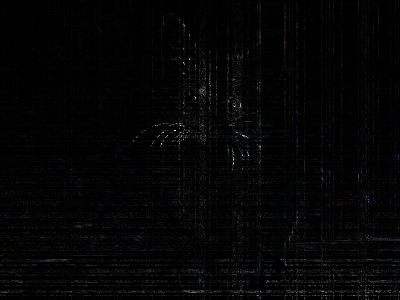

# Spatial Transformer Network with Affine, Projective and Elastic Transformations

The Spatial Transformer Network [1] allows the spatial manipulation of data within the network.

<div align="center">
  <br>
</div>

A Spatial Transformer Network implemented in Tensorflow 0.9 and based on [2] \(which is also in [3]\), [4] and [5].

This tensorflow implementation supports Affine, Projective and Elastic (Thin Plate Spline [6]) Transformations.

<div align="center">
  <br>
</div>

## How to use

```python
from stn import AffineTransformer, ProjectiveTransformer, ElasticTransformer

# Initialize
outsize = [300, 300]
stl1 = AffineTransformer(outsize)
stl2 = ProjectiveTransformer(outsize)
stl3 = ElasticTransformer(outsize)

# Transform 
y1 = stl1.transform(U, theta1)
y2 = stl2.transform(U, theta2)
y3 = stl3.transform(U, theta3)
```


## Examples 
### Input 
<div align="center">
  
</div>

### AffineTransformer
example_affine.py shows how to use AffineTransformer. Note, affine transformations preserve parallel lines.
<div align="center">
  
  
  
  
</div>

### ProjectiveTransformer
example_project.py shows how to use ProjectiveTransformer. Note, parallel lines are not parallel after transformation.
<div align="center">
  
  
  
  
</div>

### ElasticTransformer
example_elastic.py shows how to use ElasticTransformer. Here, deformations are defined with Thin Plate Splines on a 4x4 grid of control points.
<div align="center">
  
  
  
  
</div>


### Bilinear and Bicubic Interpolation
example_interp.py shows how to use Bilinear and Bicubic interpolation methods.

Bilinear:
<div align="center">
  Spatial Transformer Output:<br />
  <br />
  Tensorflow Output:<br />
  <br />
  Normalized absolute difference:<br />
  
</div>

Bicubic:
<div align="center">
  Spatial Transformer Output:<br />
  <br />
  Tensorflow Output:<br />
  <br />
  Normalized absolute difference:<br />
  
</div>

Also, the interpolation doesn't have the bug at the edges, as in [2] and [3]. See https://github.com/tensorflow/models/issues/193 for details.


## References

[1] Jaderberg, Max, et al. "Spatial Transformer Networks." 
    arXiv preprint arXiv:1506.02025 (2015)

[2] https://github.com/tensorflow/models/tree/master/transformer/transformerlayer.py

[3] https://github.com/daviddao/spatial-transformer-tensorflow

[4] https://github.com/skaae/transformer_network/blob/master/transformerlayer.py

[5] https://github.com/Lasagne/Lasagne/blob/master/lasagne/layers/special.py

[6] Fred L. Bookstein. "Principal warps: thin-plate splines and the decomposition of deformations."
    IEEE Transactions on Pattern Analysis and Machine Intelligence. (1989)
    http://doi.org/10.1109/34.24792

